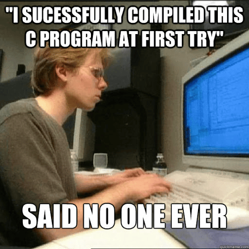
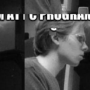

# VSB project - TGA photoshop

TGA photoshop is a student-written C project created to meet the requirements of the UPR project assignments for editing the [TGA](https://en.wikipedia.org/wiki/Truevision_TGA) uncompressed RGB images. You can load a TGA image, apply various transformations, and save the edited image back to disk. More about supported operations is located further in this document.

## Building the project

First, in order to build this project, you need to have Cmake installed in your device. If you do not have it installed, please do so.

Installation commands for Ubuntu:
```
sudo apt update
sudo apt install cmake
```

To be able to actually build this project, you have to follow these 4 steps:

1. Create a directory for your project.
2. Inside this directory, place your CMakeLists.txt and the C source files (main.c, edit_functions.c, parameters_control.c).
3. Open a terminal and navigate to your project directory.
4. Run the following commands:

```
mkdir build
cd build
cmake ..
make
```

This will configure, compile, and build the project into the photoshop executable. If everything is set up correctly, the build will succeed and you'll be ready to run your program from build directory.

>Please note that this program build is created for Linux; in the case of a Windows build, you would need to change the [CMakeList.txt](./CMakeLists.txt)

## The Project structure

This project is made in C language using common C libraries.  
Whole code is separeted into 3 c file sections and 2 header file sections:
|File|Description|
|---|:---:|
|[main.c](./main.c)|File where "basic user handling" is located. |
|[parameters_control.c](./parameters_control.c)|File, which takes care of possible user input issues. |
|[parameters_control.h](./parameters_control.h)|Header file used for parameters_control.c. Also includes short descriptions of functions. |
|[edit_functions.c](./edit_functions.c)|File, whish includes all the functions related to TGA image editing. |
|[edit_functions.h](./edit_functions.h)|Header file used for edit_functions.c. Also includes short descriptions of functions. |

## Algorithm course

### 1st state

First, in order to *run the program*, the user must enter 5 command-line arguments. *The first argument* is to **run the program**. *Two arguments* are then used to **indicate input and output**. After each of them, there must be an *argument* in which the **path to the input or output file** itself is written.  
In case of an *error* (invalid file format,file not found, etc.), an error message is displayed and the program is **terminated in mode 1**.  
If the input check is *positive* and the program is *running*, the algorithm goes into the **2nd state**.

#### Example of starting sequence

```$ ./photoshop --output output.tga --input input.tga```

### 2nd state

In the **2nd state**, the program gets into a loop. It checks the *input values* that are entered by the user into the terminal on each pass. When it finds a *match with a valid pattern*, the program goes to the **3rd state**. If this is not the case, an *error message* is displayed and the user is prompted to *re-enter the values*.

### 3rd state

During the **3rd state**, the actual changes and adjustments to the *internal image memory* occur. First, the *validity of the arguments* is checked. In this case, the data types of the arguments, the basic ranges, and their numbers are checked (especially if there are too few or too many of them). If the evaluation is stated as invalid, an error message is displayed and the user is prompted to *re-enter the values* into the terminal.  
Otherwise, the *image editing function starts*. These differ from each other, but they can be divided into two archetypes:  

#### With external buffer

Before entering the function, a *buffer* is created into which the *internal image memory* is *copied*. The *internal image memory* itself is then *freed and then expanded or reduced* to the desired values. Subsequently, the entry into the function is made and the function is performed. If it is found to be successful, it *returns 0*, changes are stored in the internal image memory, and then *only the buffer is freed and NULLed*. Otherwise, when *1 is returned*, everything must be returned to the state before the function was entered, i.e., the *internal image memory* must be freed and expanded or reduced to its original value. Then the content from the *buffer is copied into it*. Buffer is then treated in the same manner as it was stated before.

>Please note that this program is based on the Little-Endian processing system. If the program is run on a system with a big-endian processing type, full functionality of the program is not 100% guaranteed. For more information, please check [Endianness](https://stackoverflow.com/questions/4181951/how-to-check-whether-a-system-is-big-endian-or-little-endian).

#### Without external buffer

In this case of a function without an external buffer, *no external buffer* is created, as the function works directly with the *internal image memory*. Therefore, this type of function is typed as *void*; there is no need to check the validity of its execution. There is one case where if an *invalid argument* is found in the function as a parameter, an *error message* is displayed and the user is prompted to *re-enter the values*. In other functions of this type, such a thing is irrelevant, which is based on their *non-destructive nature of handling* the *internal image memory*. The function is therefore performed directly on the *internal image memory*.  

</br>

After execution of the **3rd state**, the program goes back to the **2nd state**. The exception occurs when the exit command has been inserted. Only in this case does the program go to the **4th state**.

### 4th state

In the last state, the **4th state**, the *program terminates successfully*. The current appearance of the image is saved from internal memory to the **output path**. Subsequently, the *memory allocated for the image is freed*. Finally, a condition check is performed, which breaks the loop, and the **program terminates in mode 0**.


## List of supported commands

|command|description|
|---|:---:|
|resize w,h|Resizes the image to the dimensions of width *w* and height *h*. |
|crop x,y,w,h|Only a rectangular cutout with width *w* and height *h* will be left from the image, while the upper left corner of the cutout will lie at coordinates (*x*, *y*). |
|copy x1,y1,w,h x2,y2|Pixels with width *w*, height *h*, and upper-left corner to coordinate (*x1*, *y1*) will be copied with the same dimension and upper-left corner to coordinate (*x2*, *y2*). |
|move x,y|Moves all pixels in the image by x pixels down/up and y pixels left/right (positive number -> down/right, negative number -> up/left). |
|mirror -t|Mirrors the image based on the parameter (*-v* -> vertically, *-h* -> horizontally). |
|bw|Converts the image to grayscale (he image will still be represented by RGB pixels). |
|info|Prints out the current size of the image. |
|save|Saves the current version of the image in the output file specified by the **--output** command-line argument. |
|exit|Executes the **save** command and then exits the program. |

## Example of usage

### The Input image



### The commands 

```
$ ./photoshop --output output.tga --input input.tga   
resize 256,256   
move -20,0   
crop 20,20,128,128   
copy 5,5,10,10 35,20   
save   
move 20,35   
bw   
exit  
```
### The output image



## Links

VSB UPR course

* [VSB UPR github](https://github.com/geordi/upr-course)

Details on TGA format can be found at:

* [VSB UPR TGA lecture](https://mrlvsb.github.io/upr-skripta/c/aplikovane_ulohy/tga.html)
* [More technical look at TGA](https://developer.valvesoftware.com/wiki/TGA)

Details regarding project assignment can be found at:

* [VSB UPR projects](https://github.com/geordi/upr-course/blob/master/faq/projects.md)

## License

``` 
MIT License

Copyright (c) 2024 Filip Gardoš

Permission is hereby granted, free of charge, to any person obtaining a copy
of this software and associated documentation files (the "Software"), to deal
in the Software without restriction, including without limitation the rights
to use, copy, modify, merge, publish, distribute, sublicense, and/or sell
copies of the Software, and to permit persons to whom the Software is
furnished to do so, subject to the following conditions:

The above copyright notice and this permission notice shall be included in all
copies or substantial portions of the Software.

THE SOFTWARE IS PROVIDED "AS IS", WITHOUT WARRANTY OF ANY KIND, EXPRESS OR
IMPLIED, INCLUDING BUT NOT LIMITED TO THE WARRANTIES OF MERCHANTABILITY,
FITNESS FOR A PARTICULAR PURPOSE AND NONINFRINGEMENT. IN NO EVENT SHALL THE
AUTHORS OR COPYRIGHT HOLDERS BE LIABLE FOR ANY CLAIM, DAMAGES OR OTHER
LIABILITY, WHETHER IN AN ACTION OF CONTRACT, TORT OR OTHERWISE, ARISING FROM,
OUT OF OR IN CONNECTION WITH THE SOFTWARE OR THE USE OR OTHER DEALINGS IN THE
SOFTWARE.
```